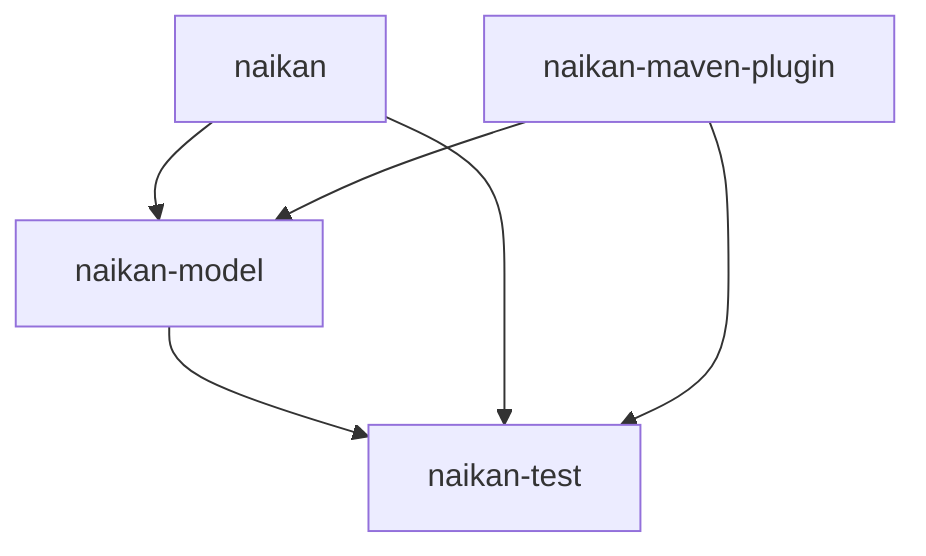

# Naikan: A Comprehensive Software Inventory Management Tool  [](/pom.xml)

Naikan is a powerful inventory management tool that allows organizations to keep track of critical information related to their software projects. It enables users to manage their projects' essential details, including project name, organization, team, contacts, developers, integrations, licenses, deployments, environments, and technologies used. The tool can be integrated into CI/CD pipelines to automatically push data for new projects and updates.

## Features

* **Automated updates**: You can automatically push new projects or update existing ones with relevant details from your CI/CD pipeline. This helps to ensure that your software project inventory is always up-to-date.

* **Team management**: Naikan allows you to see the teams, developers, and contacts behind each project, making collaboration easier.

* **Integrations**: Naikan lets you manage integrations with other tools and services used by your organization, streamlining your workflow.

* **Technologies used**: With Naikan, you can track the technologies used by each project, giving you a clear picture of your technology stack.

* **Deployments and environments**: Naikan enables you to see deployments, versions, and environments for each project, making it easier to manage your software projects.

* **License management**: Naikan lets you keep track of licenses for each project and ensure compliance, preventing any potential legal issues.

## Modules
The Naikan Project is a software that consists of four modules: naikan-test, naikan-model, naikan-maven-plugin and naikan. 



### Naikan Module (WIP)
The [naikan](https://github.com/enofex/naikan) module is the Naikan project. It provides a set of APIs and services that developers can use to register and push their applications data to Naikan. This module also contains the user interface for the application.

### Naikan Model Module
The [naikan-model](https://github.com/enofex/naikan-model) module provides the data model that represent their Naikan application data. 

### Naikan Test Module
The [naikan-test](https://github.com/enofex/naikan-test) module provides a set of tools and utilities for testing this application. 

### Naikan Maven Plugin Module (WIP)
The [naikan-maven-plugin](https://github.com/enofex/naikan-maven-plugin) module provides a maven plugin, which allows to enrich or update the Naikan model automatically.

 
## Build on Open Source Software

Naikan is built using open source software technologies, including:

* Java Temurin
* Spring Boot
* Angular
* PrimeNG, Sakai, ChartJS
* MongoDB
* JUnit 5, ArchUnit, Testcontainers
* Docker
  
## Installation

### Prerequisites

* Git
* Java
* Docker
* Node.js
* Angular CLI

### Clone the repository

Use git to clone the Naikan repository by running the following command:

`git clone git@github.com:naikan-projects/naikan.git`

### Install dependencies

Use npm to install the required dependencies for Naikan by running the following command:

1. Switch to the `naikan-client` directory
2. `npm install`

### Start the server

Use npm to start the Naikan server by running the following command:

`ng serve`

### Starting all dependencies as docker compose automatically

When you start the `NaikanApplication`, with the profile `dev` then the application will start
docker compose
`development/docker/compose.yml` automatically. 

These will start MongoDB and OpenLdap and init both with sample data from:

*  `development/docker/boms.json`
*  `development/docker/tokens.json`
*  `development/docker/users.ldif`

### OpenLDAP Users

The `LDIF` file that we will use, `development/docker/users.ldif`. Basically, it has two
users (`Admin`, `John Rambo`). With this you are able to log in to Naikan.

```
Admin > username: admin, password: 123, role: admin
John Rambo > username: jnrambo, password: 123, role: user
```

## Contributing

If you want to contribute to this project, then follow please
these [instructions](CONTRIBUTING.md).

## Website

Visit the [Naikan](https://naikan.io) Website for general information, demos and documentation.
