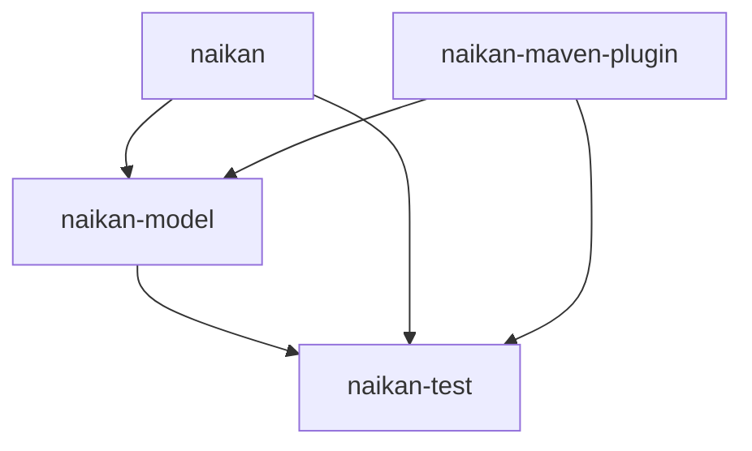

<p align="center">
    
</p>
<p align="center">
    
    
    
</p>

# Naikan: An Open Source Comprehensive Software Inventory Management Tool for Dev Teams

Tired of scattered spreadsheets and scattered information? Our user-friendly interface simplifies project inventory tool for your dev teams, ensuring seamless access to all information about your projects, whenever they need it. It enables users to manage their projects' essential details, including project name, organization, team, contacts, developers, integrations, licenses, deployments, environments, and technologies used. The tool can be integrated into CI/CD pipelines to automatically push data for new projects and updates.

<br/>

<div style="display: flex; justify-content: center;">
    
    
</div>

## Features

* **Automated updates**: You can automatically push new projects or update existing ones with relevant details from your CI/CD pipeline. This helps to ensure that your software project inventory is always up-to-date.

* **Team management**: Naikan allows you to see the teams, developers, and contacts behind each project, making collaboration easier.

* **Integrations**: Naikan lets you manage integrations with other tools and services used by your organization, streamlining your workflow.

* **Technologies used**: With Naikan, you can track the technologies used by each project, giving you a clear picture of your technology stack.

* **Deployments and environments**: Naikan enables you to see deployments, versions, and environments for each project, making it easier to manage your software projects.

* **License management**: Naikan lets you keep track of licenses for each project and ensure compliance, preventing any potential legal issues.

* **Git Integration**: The [Naikan Maven Plugin](https://github.com/enofex/naikan-maven-plugin)  will collect Git repository information and statistics from your project and push it to Naikan as well.

## Installation

```
curl -LO https://naikan.io/docker-compose.yml
docker-compose up -d
```

Visit the [Naikan](https://naikan.io) for configuration documentation and more information.

## Modules
The Naikan Project is a software that consists of four modules: naikan-test, naikan-model, naikan-maven-plugin and naikan. 



### Naikan Module
The [naikan](https://github.com/enofex/naikan) module is the Naikan project. It provides a set of APIs and services that developers can use to register and push their applications data to Naikan. This module also contains the user interface for the application.

### Naikan Model Module
The [naikan-model](https://github.com/enofex/naikan-model) module provides the data model that represent their Naikan application data. 

### Naikan Test Module
The [naikan-test](https://github.com/enofex/naikan-test) module provides a set of tools and utilities for testing this application. 

### Naikan Maven Plugin Module
The [naikan-maven-plugin](https://github.com/enofex/naikan-maven-plugin) module provides a maven plugin, which allows to enrich or update the Naikan model automatically from POM, custom provider or a Naikan BOM.

## Build on Open Source Software

Naikan is built using open source software technologies, including:

* Java Temurin
* Spring Boot
* Angular
* PrimeNG, Sakai, ChartJS
* MongoDB
* JUnit 5, ArchUnit, Testcontainers
* Docker

## Backers

The Open Source Community and [Enofex](https://enofex.com)

<br>
<a href="https://github.com/enofex/naikan/graphs/contributors">
  
</a>
<br>

## Contributing

If you want to contribute to this project, then follow please these [instructions](CONTRIBUTING.md). Follow this [documentation](DEVELOPING.md) starting this application locally.

## Website

Visit the [Naikan](https://naikan.io) Website for general information, demos and documentation.
