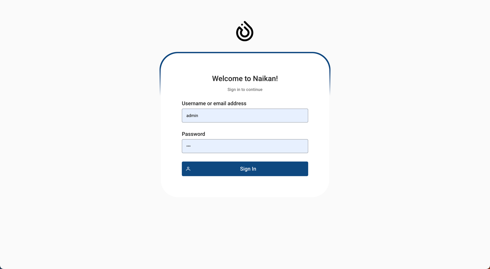
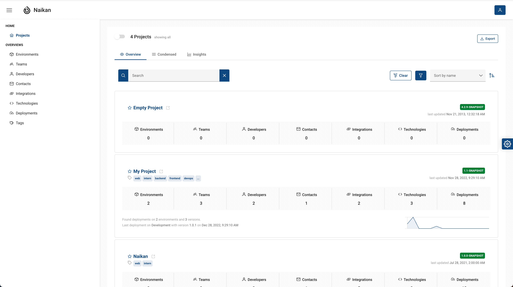
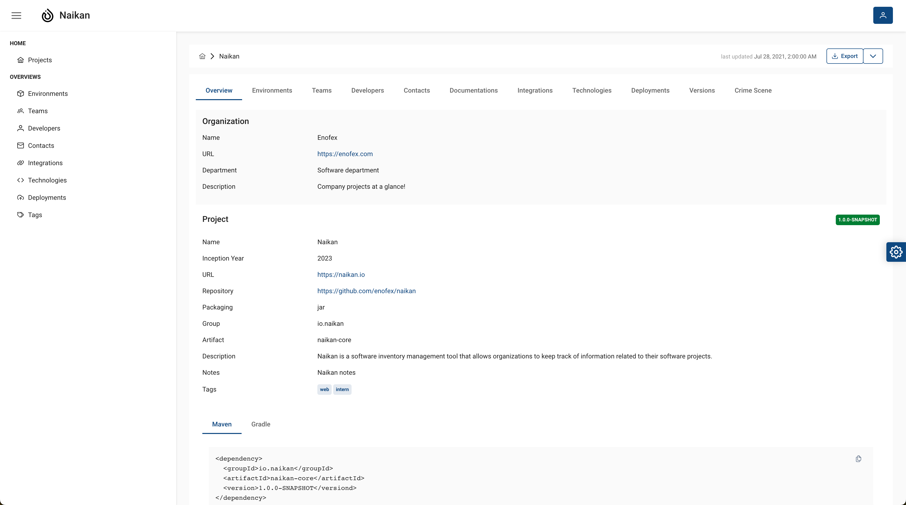
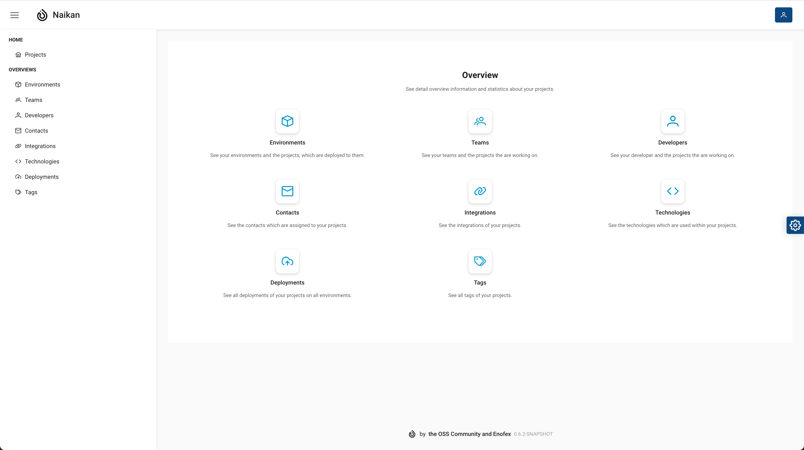
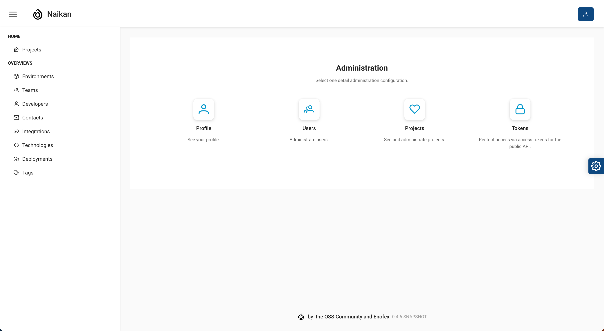

Welcome to *Naikan*, the ultimate inventory management tool designed to streamline your software
projects. With *Naikan*, organizations can effortlessly stay on top of critical project information,
ensuring seamless project management and improved efficiency.

Naikan is equipped with a comprehensive set of features that enable users to manage and track
essential details of their projects. From the project's inception to its deployment and beyond,
Naikan covers all the bases. You can easily organize information such as project name,
organization, team members, contacts, developers, integrations, licenses, deployments, environments,
and the technologies utilized.

Integrating *Naikan* into your CI/CD pipelines takes your project management to the next level. By
seamlessly pushing data for new projects and updates, *Naikan* ensures that your inventory remains
up
to date with minimal effort. This integration saves you valuable time and eliminates the risk of
manual errors.

With *Naikan*, you can say goodbye to scattered spreadsheets and disjointed communication. Our
user-friendly interface allows you to navigate effortlessly through your project inventory,
ensuring that all stakeholders have access to the right information at the right time.

Key Features of *Naikan*:

1. **Comprehensive Project Details**: Capture and manage vital project information such as project
   name, organization, team members, and contacts in a centralized location.

2. **Developer Management**: Keep track of your development team, assign responsibilities, and
   monitor
   their progress.

3. **Integrations and Licenses**: Easily manage integrations with other tools and track software
   licenses to ensure compliance.

4. **Deployment and Environment Tracking**: Monitor deployments and maintain an overview of
   different
   environments associated with your projects.

5. **Technology Management**: Track the technologies utilized in your projects, ensuring
   transparency
   and facilitating future decision-making.

6. **Seamless CI/CD Integration**: Integrate *Naikan* into your CI/CD pipelines to automate data
   updates,
   eliminating manual data entry and reducing errors.

Naikan empowers organizations to optimize their software project management, enhance collaboration,
and ensure accurate tracking of project details. Say goodbye to project management headaches and
embrace a streamlined approach with *Naikan* today.

### Projects overview

See all projects at a glance, filter, sort and search them.

### Project details

See detail information about your projects.

* **Project base information**: Name, URL, Repository, Notes, Tags...
* **Organization**: Name, URL, Department...
* **Environments**: Name, Location, Tags..
* **Teams**: Name
* **Developers**: Name, Username, Title, Department, Email, Phone...
* **Contacts**: Name, Title, Email, Phone, Roles...
* **Documentations**: Name, Location, Tags...
* **Integrations**: Name, URL, Tags...
* **Technologies**: Name, Version, Tags...
* **Deployments**: Environment, Location, Timestamp, Version..
* **Versions**: Versions, Deployments...
* **Licenses**: Name, URL
* **and much more**

### Overview statistics

See detail overview information and statistics about your projects.

* **Environments**: See your environments and the projects, which are deployed to them.

* **Teams**: See your teams and the projects they are working on.

* **Developers**: See your developer and the projects they are working on.

* **Contacts**: See the contacts which are assigned to your projects.

* **Integrations**: See the integrations of your projects.

* **Technologies**: See the technologies which are used within your projects.

* **Deployments**: See all deployments of your projects on all environments.

### Administration

Administrate user roles, tokens and projects.

* **Profile**: See your profile.

* **Users**: Administrate users.

* **Projects**: See and administrate projects.

* **Tokens**: Restrict access via access tokens for the public API.

