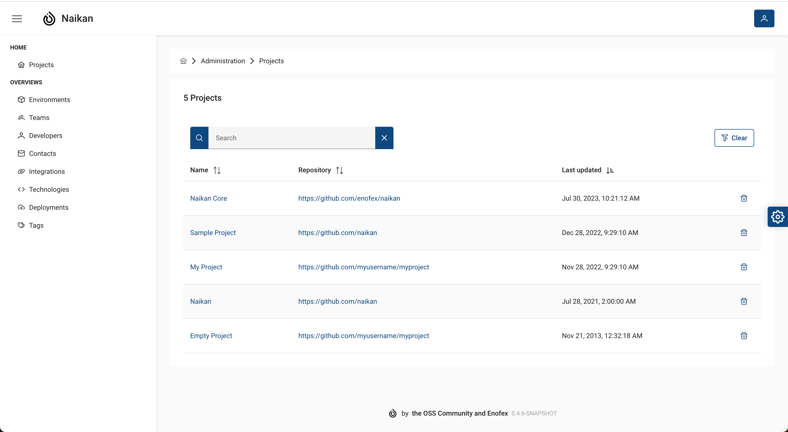

# Administration

!!! note "Administration"

    For full functionality within the administration you need __ADMIN__ roles.

## Project administration

In the project administration you are able to delete projects from *Naikan*.

## User administration

In this project, we have implemented a user authentication system for our application. Upon the
initial login, the first user to access the application will be granted administrative privileges.

### Implementation Details

#### Login Functionality

Users can access the application using their registered credentials.

#### Admin Role Assignment

When a user successfully logs in, a specific check is performed to identify if they are the first
user.
If the user is the first one to log in, they are automatically assigned the admin role.
The admin role grants additional privileges and access to specific administrative features within
the application.

#### Admin Privileges

The user assigned as the first admin has the ability to perform administrative tasks by accessing
restricted sections of the application.
The admin role ensures that the initial user has the necessary authority to administer the
application.

#### User Management

Once the first user has been assigned the admin role, they can manage user accounts by granting or
revoking admin privileges for other users.
The admin has control over creating, modifying, or deleting tokens for the REST API.

## Token administration

This project requires a bearer token to securely access the API REST endpoints used for pushing data
from CI/CD pipelines to Naikan and managing deployment-related information. To ensure secure access
and authorization, a bearer token is required when interacting with these API endpoints.

### Bearer Token Configuration

Before accessing the API endpoints, ensure that the necessary tokens are properly configured within
the application, which can be done as an admin role.

### Using the Bearer Token

When making requests to the API endpoints, include the bearer token in the request headers. Add
an `Authorization` header, with the value `Bearer [token]`. Replace `[token]` with the actual bearer
token obtained during the token generation process.

### Protecting the Bearer Token

Treat the bearer token as a sensitive piece of information. Store it securely and avoid exposing it
in public repositories or transmitting it over insecure channels. It is recommended to use
environment variables or a secure key management system to store and retrieve the bearer token.