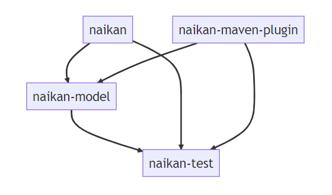

## Contributing

Thank you for your interest in contributing to *Naikan*! We welcome contributions from the community
to help make the project even better. Here are some ways you can get involved:

* Star the Project:

    - Show your support by starring the project
      on [GitHub](https://github.com/enofex/naikan).
    - This helps increase visibility and encourages others to discover and contribute to the
      project.

* Review the Contribution Guide:

    - Familiarize yourself with the guidelines and procedures outlined in our contribution guide.
    - The contribution guide provides detailed information on how to get started and the different
      ways
      you can contribute.

* Follow Contribution Guidelines:

    - Ensure that you follow our
      contribution [guidelines](https://github.com/enofex/naikan/blob/main/CONTRIBUTING.md)
      when submitting your contributions.
    - These guidelines cover aspects such as code formatting, documentation standards, and other
      important considerations.

* Pull Requests:

    - If you have improvements or fixes to propose, submit a Pull Request (PR) to the relevant
      module or
      repository.
    - Clearly describe the purpose and changes made in your PR, providing enough context for the
      reviewers to understand your contribution.
    - Be open to feedback and engage in discussions to refine your contribution.

* Bug Reports and Feature Requests:

    - Help us improve *Naikan* by reporting any bugs or issues you encounter.
    - If you have ideas for new features or enhancements, submit a feature request.
    - Use the issue tracker in the respective repository to provide detailed information about the
      problem or request.

* Spread the Word:

    - Share your positive experience with *Naikan* and encourage others to contribute.
    - Tweet about your contributions, write blog posts, or mention *Naikan* in relevant communities
      to
      increase awareness.

* Help with Documentation:

    - Contribute to improving the documentation by identifying areas that need clarification or
      adding
      examples and tutorials.
    - Submit documentation PRs to enhance the usability and understanding of *Naikan*.

Remember, contributions of all sizes are valuable and appreciated. We look forward to your
involvement in the *Naikan* community. Thank you for considering contributing to the project!

## Modules

The *Naikan* Project is a software that consists of four modules: naikan-test, naikan-model,
naikan-maven-plugin and naikan.

  

### *Naikan* Module

The [naikan](https://github.com/enofex/naikan) module is the *Naikan* project. It provides a set of
APIs and services that developers can use to register and push their applications data to *Naikan*.
This module also contains the user interface for the application.

### *Naikan* Model Module

The [naikan-model](https://github.com/enofex/naikan-model) module provides the data model that
represent their *Naikan* application data.

### *Naikan* Test Module

The [naikan-test](https://github.com/enofex/naikan-test) module provides a set of tools and
utilities for testing this application.

### *Naikan* Maven Plugin Module

!!! note "Work in progress"

    The Maven Plugin Module is not published at the moment.

The [naikan-maven-plugin](https://github.com/enofex/naikan-maven-plugin) module provides a maven
plugin, which allows to enrich or update the *Naikan* model automatically.

# Sponsor

If your organization has sponsored or if you have any questions related to sponsorship or have
chosen a tier that includes logo placement, please feel free to reach out to info@enofex.com. I will
be happy to help you quickly.

[Sponsor Naikan on GitHub :heart:](https://github.com/sponsors/mnhock){ .md-button }