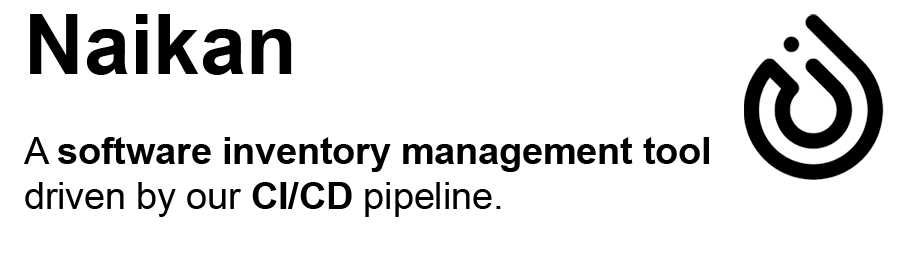
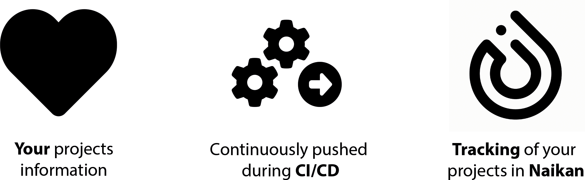

#

[Get Started](./getting-started/){ .md-button .md-button--primary }
[View on GitHub :simple-github:](https://github.com/enofex/naikan-projects){ .md-button }

*Naikan* is a powerful inventory management tool that allows organizations to keep track of critical
information related to their software projects. It enables users to manage their projects' essential
details, including project name, organization, team, contacts, developers, integrations, licenses,
deployments, environments, and technologies used. The tool can be integrated into CI/CD pipelines to
automatically push data for new projects and updates.

## Automatic CI/CD Integration for Pushing Project Information to Naikan

By integrating the CI/CD pipeline with Naikan, project information can be seamlessly transferred,
ensuring up-to-date and accurate data for
monitoring and analysis purposes.

  

## Workflow Steps

* **JSON File Configuration**: Create a JSON file that contains the necessary project information.
  The JSON file should follow a predefined structure to ensure compatibility with Naikan's data
  requirements. Include relevant details such as project name, key metrics, status updates, and any
  other pertinent information.

* **CI/CD Pipeline Setup**: Configure a CI/CD pipeline using your preferred tool (e.g., Jenkins,
  GitLab CI/CD, Bamboo, Travis CI). Define the necessary pipeline stages and steps to ensure the
  successful execution of the workflow.
  Ensure that the pipeline has access to the JSON file containing the project information.

* **Push to Naikan**: Add a dedicated stage in the CI/CD pipeline to push the project information to
  Naikan.
  Utilize the appropriate Naikan API endpoint to transfer the JSON file's contents automatically.
  Ensure that the pipeline has the necessary authentication tokens to access Naikan
  securely.

## Features

* **Automated updates**: You can automatically push new projects or update existing ones with
  relevant details from your CI/CD pipeline. This helps to ensure that your software project
  inventory is always up-to-date.

* **Team management**: *Naikan* allows you to see the teams, developers, and contacts behind each
  project, making collaboration easier.

* **Integrations**: *Naikan* lets you manage integrations with other tools and services used by your
  organization, streamlining your workflow.

* **Technologies used**: With *Naikan*, you can track the technologies used by each project, giving
  you a clear picture of your technology stack.

* **Deployments and environments**: *Naikan* enables you to see deployments, versions, and
  environments for each project, making it easier to manage your software projects.

* **License management**: *Naikan* lets you keep track of licenses for each project and ensure
  compliance, preventing any potential legal issues.

## Sponsors

If *Naikan* has helped you save time and money, I invite you to support my work by becoming a
sponsor.
By becoming a [sponsor](https://github.com/sponsors/mnhock), you enable me to continue to improve
Naikan's capabilities by fixing bugs immediately and continually adding new useful features. Your
sponsorship plays an important role in making *Naikan* even better.

## License

See [LICENSE](https://github.com/enofex/naikan-projects/blob/main/LICENSE).